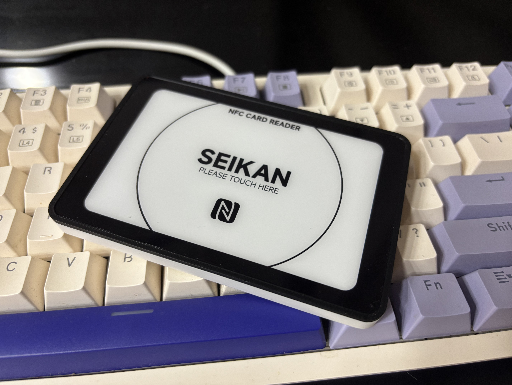
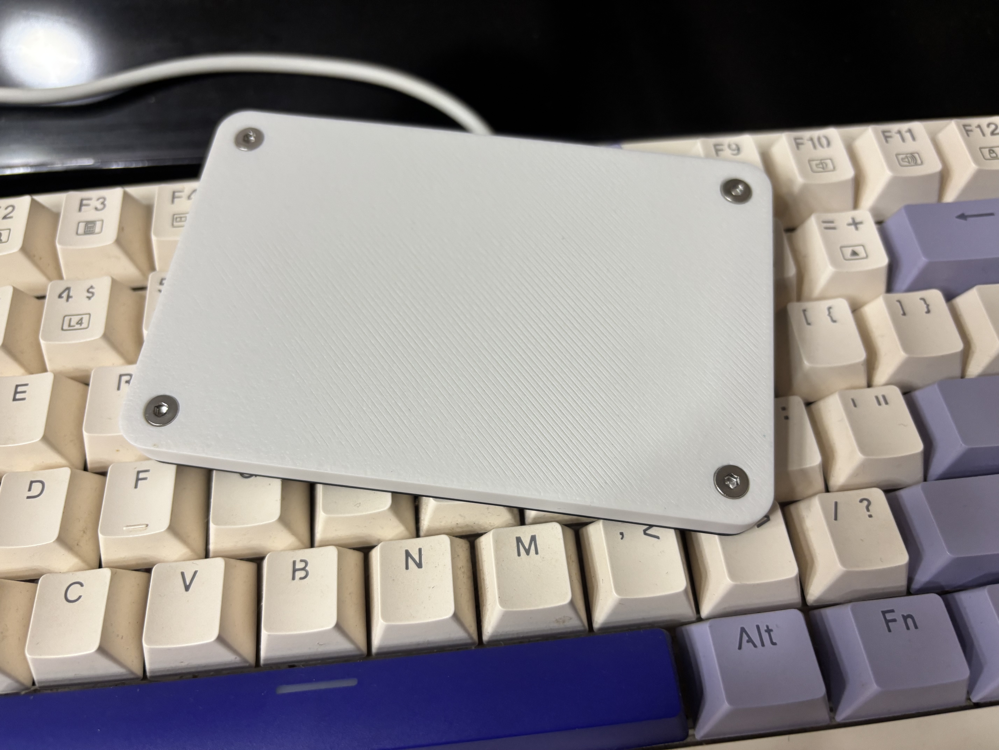
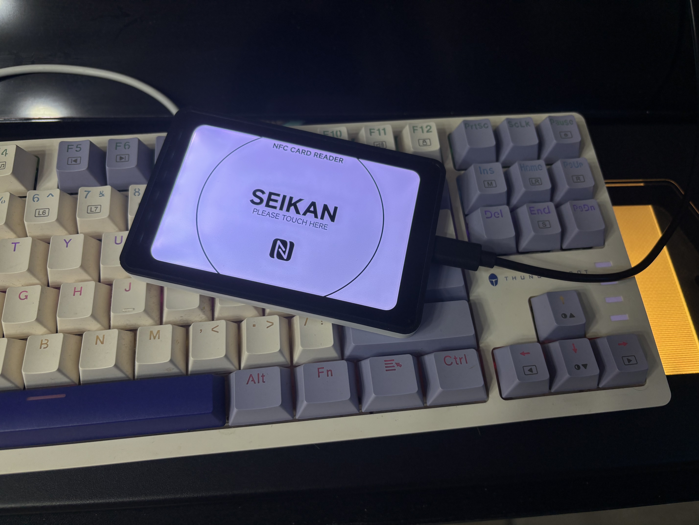

## 注意
3D打印文件等在附件内，也可前往GitHub下载
```
主壳.step：白色PLA 3D打印
顶壳.step：黑色PLA 3D打印
顶板.dxf：顶部亚克力，1mm，建议到JLC做，要求：黑边需要强遮光且仅黑边需要背胶（重要）
导光板.dxf：2mm导光板，如果不知道是什么的可以用磨砂亚克力替代（效果肯定会差一些）
导光板_打点.dxf：如果有能力的话用这个，不多说
Panel.eps/png：出厂涂装
```

## 项目简介
本项目是基于PN532的NFC读卡器（可用于Aime、Amusement IC游戏读取），是目前SEIKAN在售的「Akari NEW+」型号

## 项目功能
可搭配固件当作普通的PN532读卡器使用，也可搭配aimeio和spice等工具进行SEGA、KONAMI系游戏的读取

## 项目参数
* 本设计采用WCH的CH552作为主控芯片
* 本设计采用NXP的PN532作为NFC读取芯片
* 天线已经过调教，读取状态良好，目前为仿真的最佳参数
* 搭载LED机能，可通过HID进行控制

## 组装流程
暂无，正在努力编写

## 实物图






